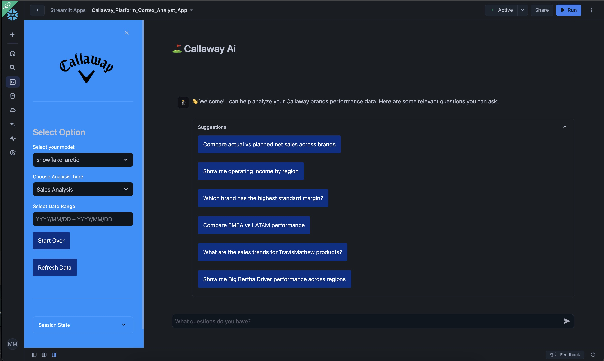

# TCBrands Cortex Analyst 🤖
## Examples

## 📚 Overview
TCBrands Cortex Analyst leverages Snowflake's intelligent AI service to provide powerful data analysis capabilities. This project utilizes state-of-the-art large language models including Meta Llama and Mistral models, running securely inside Snowflake Cortex.

## 🚀 Quick Start
Follow our comprehensive quickstart guide to begin:
- [Getting Started with Cortex Analyst](https://quickstarts.snowflake.com/guide/getting_started_with_cortex_analyst/index.html?index=..%2F..index#0)
- [Snowflake Cortex Documentation](https://docs.snowflake.com/en/user-guide/snowflake-cortex/cortex-analyst)

## 🧠 AI Models
By default, Cortex Analyst is powered by:
- Meta Llama models
- Mistral models
- Optional Azure-hosted OpenAI GPT models

> **Note**: At runtime, Cortex Analyst automatically selects the optimal combination of models to ensure maximum accuracy and performance for each query.

## 🛠️ Development Resources

### ❄️ Semantic Model Tools
- [Semantic Model Generator](https://github.com/Snowflake-Labs/semantic-model-generator)
- [Semantic Model Specification](https://docs.snowflake.com/en/user-guide/snowflake-cortex/cortex-analyst/semantic-model-spec)

### ❄️ Snowflake CLI
- [snowCLI]([https://docs.snowflake.com/user-guide/snowflake-cortex/cortex-analyst/rest-api](https://docs.snowflake.com/developer-guide/snowflake-cli/index))
  
### ❄️ API Reference
- [REST API Documentation](https://docs.snowflake.com/user-guide/snowflake-cortex/cortex-analyst/rest-api)

## 🔒 Security & Compliance
Learn about our commitment to AI safety and ethical use:
- [Snowflake AI Trust and Safety](https://www.snowflake.com/en/legal/compliance/snowflake-ai-trust-and-safety/)

## 📖 Related Documentation
- [Azure OpenAI Integration Guide](https://docs.snowflake.com/en/user-guide/snowflake-cortex/cortex-analyst)
- [Model Selection Documentation](https://docs.snowflake.com/en/user-guide/snowflake-cortex/cortex-analyst)

---

  Made with ❄️ for the TCBrands Platform Team

